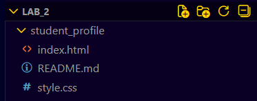
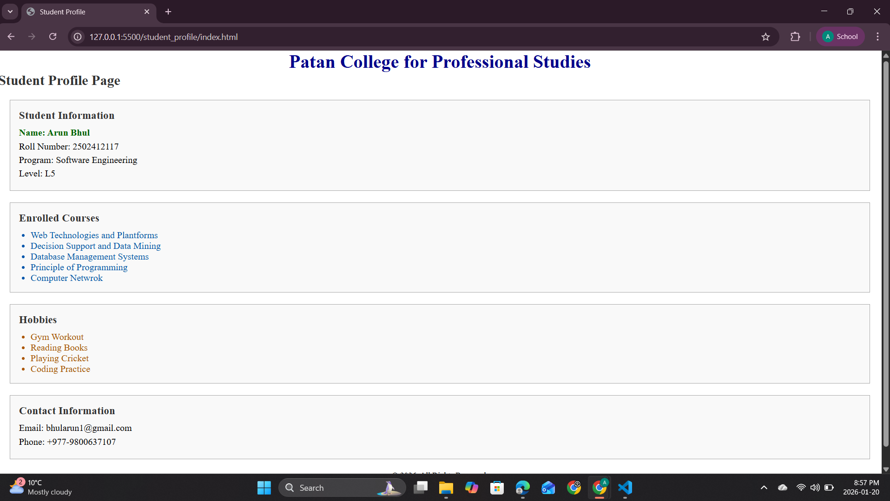
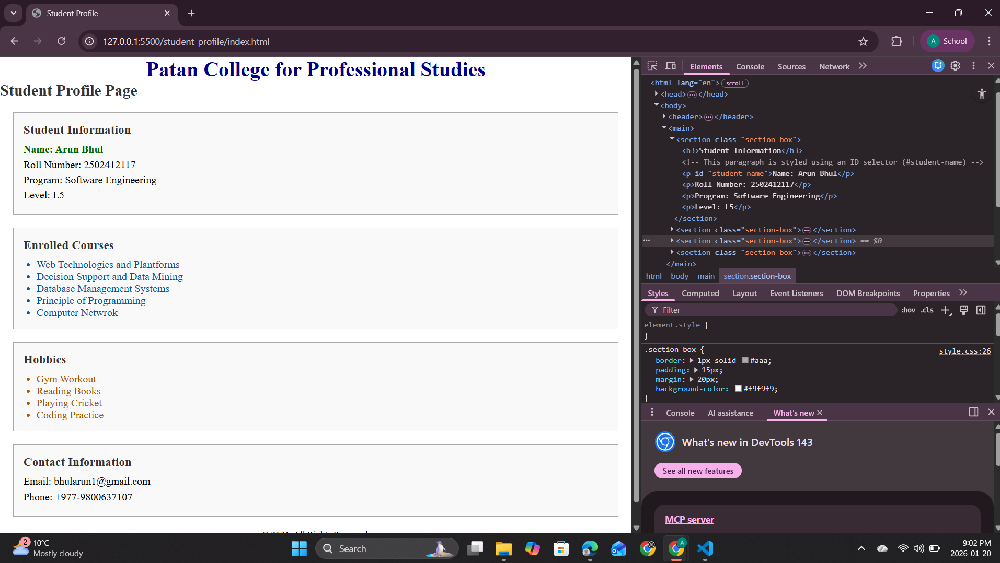

# Lab Assignment 02 – HTML and CSS Fundamentals Using Selectors

## Course Information
- **Course Name:** Web Technologies and Platforms  
- **Lab Title:** HTML and CSS Fundamentals Using Selectors  
- **Assignment Type:** Individual  

---

## Objective
The objective of this lab assignment is to design a **Student Profile Web Page** using **semantic HTML** and **external CSS**, focusing strictly on **CSS selector usage**.  
This lab helps in understanding how to separate content from presentation using different CSS selectors.

---

## Tools and Technologies Used
- **HTML5**
- **CSS3 (Selectors only)**
- **Code Editor:** Visual Studio Code
- **Browser:** Google Chrome / Mozilla Firefox

## Screenshots 

